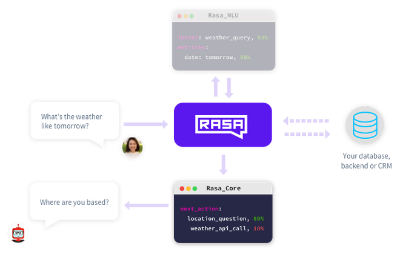

# Chatbot

# What is Rasa?
<li>Rasa is a tool to build custom AI chatbots using Python and natural language understanding (NLU). Rasa provides a framework for developing AI chatbots that uses natural language understanding (NLU). It also allows the user to train the model and add custom actions.</li>

## Installation of Rasa  on windows
<a href="https://rasa.com/docs/rasa/2.x/installation/">link for installation guide </a>